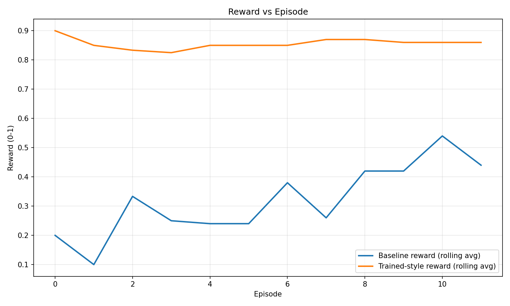
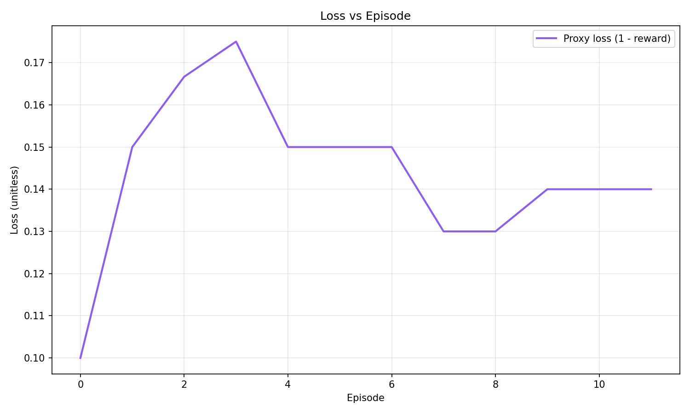
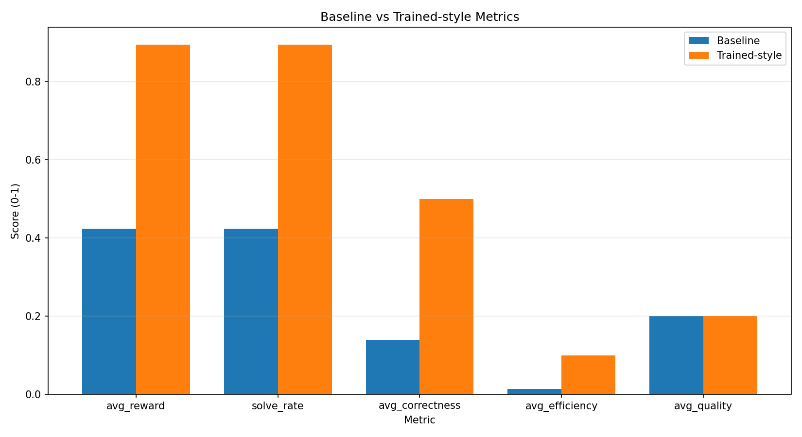

OpenAdapt: Adaptive Meta-Environment System

OpenAdapt is an OpenEnv-based LLM that generates its own training environments for training agents to diagnose production services utilizing RL to progressively self-learn and improve its metrics"

OpenAdapt is an OpenEnv-based incident-triage environment for training LLM agents to diagnose degraded production services under partial information.

## Why it matters

Current LLM post-training pipelines need humans to design every environment. That doesn't scale.

OpenAdapt removes that bottleneck. One prompt → full training loop. The system figures out what a good environment looks like, validates it automatically, and makes it harder as the agent improves.

## Environment Overview

- **Observation**: service alert context, logs, metrics, runbook snippets, and episode metadata.
- **Action**: structured `diagnose_incident` payload with `service`, `root_cause`, `mitigation`, `evidence`, `confidence`, and reasoning.
- **Reward**: multi-component score with correctness, efficiency, quality, calibration, and penalty terms.
- **API**: standard `reset`, `step`, `state` contract via OpenEnv.

### Environment Complexity Index (ECI)

Every generated environment supports 5 difficulty tiers:

| ECI | What changes |
|-----|-------------|
| 1 | Base task, clean observations |
| 2 | Noisy / incomplete fields injected |
| 3 | Adversarial distractors in context |
| 4 | Hidden constraints — agent must infer from behavior |
| 5 | All of the above + reduced step budget |

The curriculum controller monitors `solve_rate_signal` from the environment's `info` dict and triggers ECI escalation automatically.

## Reward Design

Multi-component reward — not binary:

```
reward = correctness  (0.0 – 0.50)
       + efficiency   (0.0 – 0.30)   # penalizes burning steps
       + quality      (0.0 – 0.15)   # action structure + reasoning
       + calibration  (0.0 – 0.05)   # honest confidence scoring
       + penalty      (−0.50 – 0.0)  # anti-gaming
```

The penalty term specifically catches agents that exploit the reward without solving the task.


## Links

- **Hugging Face Space**: [itzrick/openadapt](https://huggingface.co/spaces/itzrick/openadapt)
- **Colab notebook**: [openadapt-training-colab](https://colab.research.google.com/drive/1Wp53Y7pcFkIxUhb4hpRPvSE9U5wToygB?usp=sharing)
- **Training WanDB logs**: [openadapt-training-logs](https://wandb.ai/shahirabdulnazar2003-/openenv-grpo/runs/60kg8y2c)
- **Blog**: [blog.md](artifacts/writeup/blog.md)

## Results

Tested on the **Incident Triage** environment (agent diagnoses degraded services from noisy logs, metrics, and runbook context):

| Metric | Baseline | Trained |
|--------|----------|---------|
| Avg Reward | 0.424 | **0.895** |
| Solve Rate | 42.4% | **89.5%** |

### Plots


*Reward progression across training episodes. Baseline flat at ~0.42, trained policy climbs to ~0.90.*


*Proxy loss (1 − reward) across episodes.*


*Side-by-side comparison of all metrics.*

## Reproducible Commands

Validate OpenEnv package:

```powershell
cd envs/incident_triage
openenv validate --verbose
```

Run local benchmark harness:

```powershell
python -m src.training.train_grpo --episodes 40 --output artifacts/training_metrics.jsonl
python -m src.training.export_submission_artifacts
```

Run unit tests:

```powershell
python -m unittest discover -s tests -p "test_openenv_incident_triage.py"
```

## Repo Structure

```
adaptive-meta-env/
├── envs/incident_triage/     # Seed environment (OpenEnv-compliant)
├── generated_envs/           # Environments auto-generated by Designer Agent
├── src/
│   ├── designer/             # Designer Agent + prompt templates
│   ├── validator/            # Sandbox validation harness
│   ├── curriculum/           # ECI escalation controller
│   └── training/             # GRPO training loop
├── prompts/                  # System prompts (designer, solver, curriculum)
├── notebooks/                # Colab training notebook
├── artifacts/
│   ├── plots/                # Training curves
│   ├── metrics/              # submission_summary.json
│   └── writeup/              # Blog + short writeup
└── Dockerfile
```

## How it works

```
User: "Train an agent to diagnose degraded production services"
          │
          ▼
    Designer Agent
    (generates OpenEnv-compliant environment code)
          │
          ▼
    Sandbox Validator
    (runs dummy agent for 10 steps, checks API contracts)
    fails? ──► sends traceback back to Designer to self-correct
          │
          ▼
    OpenEnv Server
    (serves reset / step / state)
          │
          ▼
    GRPO Training Loop (Unsloth + TRL)
    (solver agent trains on the environment)
          │
    solve_rate > 90%?
          │ yes
          ▼
    Curriculum Controller
    (Designer escalates ECI: adds noise, confounders, hidden constraints)
          │
          └──► loop continues at higher difficulty
```

---

## Tech Stack

OpenEnv · TRL · Unsloth · GRPO · Weights & Biases · Hugging Face Spaces · Docker · FastAPI

## Notes

- OpenEnv dependency is tracked via GitHub main in `envs/incident_triage/pyproject.toml`.
- Large media files are intentionally excluded; 
